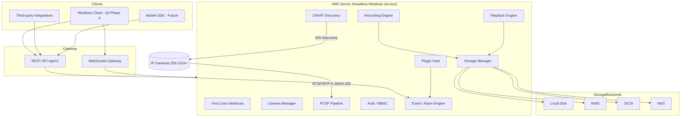
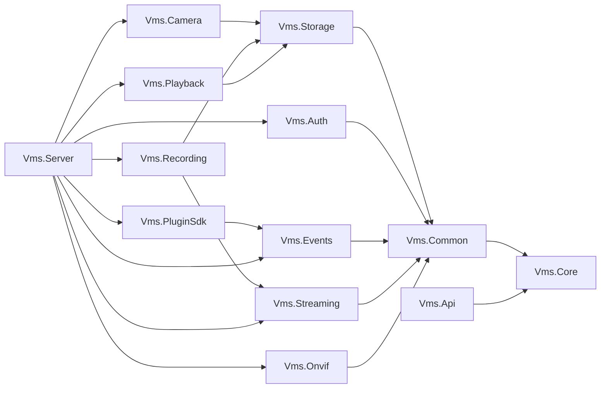
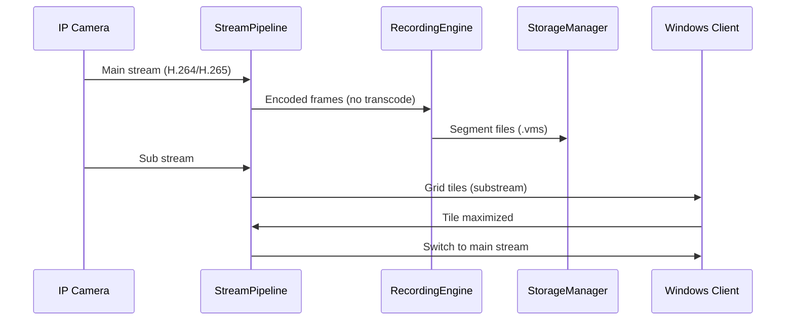
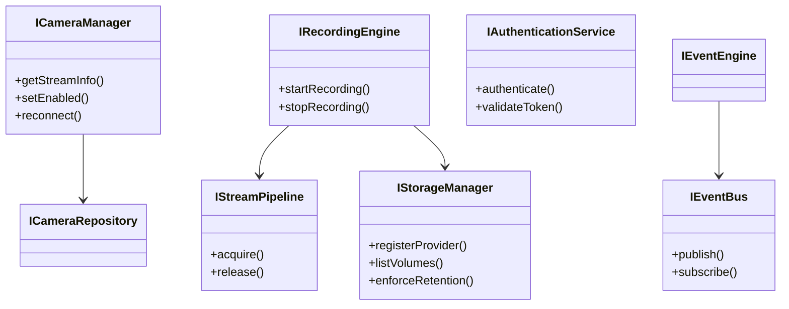

# Enterprise VMS — Phase 1 Architecture

## Mission

Design and implement a commercial-grade, vendor-neutral Video Management System (VMS/NVR) with a headless Windows Server, Windows Client, REST API, WebSocket Gateway, Plugin SDK, and future Mobile SDK.

Phase 1 delivers the **modular architecture foundation**: shared interfaces, domain models, independent buildable modules, unit tests, and server bootstrap — without a monolithic codebase.

## System Context

## Module Dependency Graph

## Core Design Principles

| Principle | Implementation |
|-----------|----------------|
| No monolith | 13 independent CMake modules under `modules/` |
| SOLID | Pure virtual interfaces in `Vms.Core`; concrete modules depend on abstractions |
| Thread-safe | `std::mutex` on shared mutable state; async I/O planned for Phase 2 |
| Pass-through recording | `IRecordingWriter` contract writes original main-stream bitstream |
| Substream live view | `StreamProfile::Sub` for grids; `StreamProfile::Main` on maximize |
| DI | `ServiceRegistry` wires implementations in `ServerHost` |
| Testability | Catch2 unit tests per module |

## Interface Layer (`Vms.Core`)

All subsystems communicate through documented interfaces:

- **Camera**: `ICameraRepository`, `ICameraManager`
- **Discovery**: `IOnvifDiscovery`
- **Streaming**: `IStreamPipeline`, `IStreamSession`
- **Recording**: `IRecordingEngine`, `IRecordingWriter`
- **Playback**: `IPlaybackEngine`
- **Storage**: `IStorageProvider`, `IStorageManager`
- **Security**: `IAuthenticationService`, `IAuthorizationService`
- **Events**: `IEventBus`, `IEventEngine`
- **Plugins**: `IPlugin`, `IPluginHost`

## Recording & Live View Strategy

## Database Schema (Phase 2)

Relational schema will be introduced with SQLite/PostgreSQL in Phase 2. Planned tables:

- `cameras`, `camera_streams`, `recording_segments`, `bookmarks`
- `users`, `roles`, `role_permissions`, `audit_log`
- `events`, `alarms`, `storage_volumes`, `retention_policies`

Phase 1 uses `InMemoryCameraRepository` and filesystem-backed segments.

## Technology Stack

| Layer | Phase 1 | Future Phases |
|-------|---------|---------------|
| Core interfaces | C++20 | C++20 |
| Server host | C++20 (Linux dev / Windows deploy) | Windows Service wrapper |
| RTSP/ONVIF | Interface stubs | Boost.Asio + gSOAP/ONVIF |
| REST/WebSocket | API contracts | Boost.Beast or .NET 8 gateway |
| Client | N/A | Qt 6 (Windows) |
| AI modules | Plugin SDK interface | ONNX Runtime plugins |

## Phase Roadmap

| Phase | Scope |
|-------|-------|
| **1 (current)** | Architecture, interfaces, module skeleton, tests, server bootstrap |
| **2** | RTSP ingest, ONVIF discovery, REST/WebSocket gateway, DB persistence |
| **3** | Recording index, playback demux, retention enforcement |
| **4** | Qt Windows client, live grid, timeline, PTZ |
| **5** | Windows Service installer, TLS, audit, AI plugin samples |

## Class Diagram (Core Abstractions)

## Security Model

- **Authentication**: Token-based sessions (`IAuthenticationService`)
- **Authorization**: RBAC with granular `Permission` enum
- **Default admin**: `admin` / `admin` (change in production)
- **Phase 2**: TLS 1.3, encrypted credential storage, audit trail

## Performance Targets

- 256 cameras initial capacity; architecture supports 1024+
- Main-stream recording without transcoding minimizes CPU
- Substream fan-out for multi-client live grids
- 24/7 uptime: graceful reconnect, health events, storage monitoring
